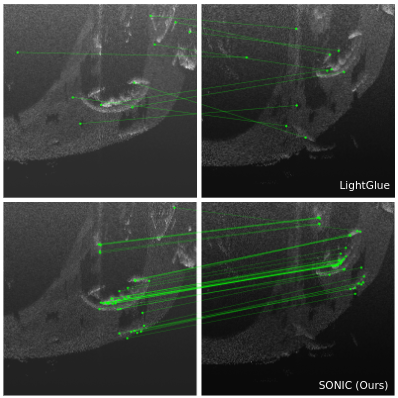

# "SONIC: Sonar Image Correspondence using Pose Supervised Learning for Imaging Sonars"
### "Samiran Gode*, Akshay Hinduja*, Michael Kaess"
EMail: ahinduja@alumni.cmu.edu, sgode@alumni.cmu.edu 

paperurl: "https://arxiv.org/pdf/2310.15023.pdf"

## Abstract
In this paper, we address the challenging problem of data association for underwater SLAM through a novel method for sonar image correspondence using learned features. We introduce SONIC (SONar Image Correspondence), a pose-supervised network designed to yield robust feature correspondence capable of withstanding viewpoint variations. The inherent complexity of the underwater environment stems from the dynamic and frequently limited visibility conditions, restricting vision to a few meters of often featureless expanses. This makes camera-based systems suboptimal in most open water application scenarios. Consequently, multibeam imaging sonars emerge as the preferred choice for perception sensors. However, they too are not without their limitations. While imaging sonars offer superior long-range visibility compared to cameras, their measurements can appear different from varying viewpoints. This inherent variability presents formidable challenges in data association, particularly for fea
ture-based methods. Our method demonstrates significantly better performance in generating correspondences for sonar images which will pave the way for more accurate loop closure constraints and sonar-based place recognition. Code as well as simulated and real-world datasets will be made public to facilitate further development in the field.


## Data, Demo, training and Usage

### Dataset

Dataset url: "https://drive.google.com/drive/folders/1ykFXI9AJjrRCmz7MvjdqdCq7e-4Hir-c?usp=sharing"

### Demo

Use <b>sonic-list.txt</b> to setup your conda environment.

Please look at the Jupyter notebook in /Jupyter. To run the demo, you will need to download at least SHIP_BPL_H3 sub-dataset and the pair files and place them in the appropriate locations. Convention used in code is "YOUR_DIR_HERE"/logs/pairs...txt and data is placed under the same directory like "YOUR_DIR_HERE"/logs/...

### Training

To retrain the network, you can download the entire dataset, and set the file names of the pair files under sonardata.py to be pairs.txt, pairs_post.txt, pairs_val.txt and pairs_pos_val.txt respectively for training and validation.

### Usage

SONIC_test.py will have all the necessary functions to use SONIC in your own downstream tasks. Specifically look at expectation_matching(). 


## Citation
S Gode*, A Hinduja*, and M Kaess , "SONIC: Sonar Image Correspondence using Pose Supervised Learning for Imaging Sonars" in
Proc. IEEE Intl. Conf. on Robotics and Automation (ICRA), Yokohama, Japan,
May 2024.

```
@inproceedings{gode2024sonic,
    title={SONIC: Sonar Image Correspondence using Pose Supervised Learning for Imaging Sonars},
    author={Gode, Samiran and Hinduja, Akshay and Kaess, Michael},
    booktitle={Proc. IEEE Intl. Conf. on Robotics and Automation (ICRA)},
    year={2024},
    month={May},
    address={Yokohama, Japan}
}

```
